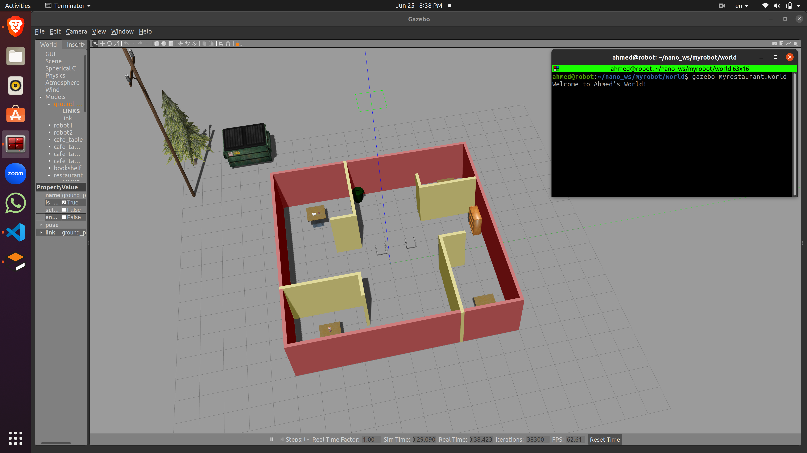

### Directory Structure
    .myrobot                           # myrobot lab main folder 
    ├── images                         # Code output image                   
    │   ├── myworld.png
    ├── model                          # Model files of the two-wheeled robot
    │   ├── robot
    │   │   ├── model.config
    │   │   ├── model.sdf
    ├── script                         # Gazebo World plugin C++ script      
    │   ├── Welcom.cpp
    ├── world                          # Gazebo main World empty scene
    │   ├── myrestaurant
    ├── CMakeLists.txt                 # Link libraries 
    └──                              

Step_1
```
$ git clone https://github.com/Ahmed-Magdi1/Build-My-World.git
```

Step_2 
```
$ cd /home/Build-My-World/
$ mkdir build
$ cd build/
$ cmake ../
$ make
```

Step_3
```
export GAZEBO_PLUGIN_PATH=${GAZEBO_PLUGIN_PATH}:~/Build-My-World/myrobot/build
```

Step_4
```
$ cd /home/Build-My-World/myrobot/world/
$ gazebo myrestaurant
```

Output




